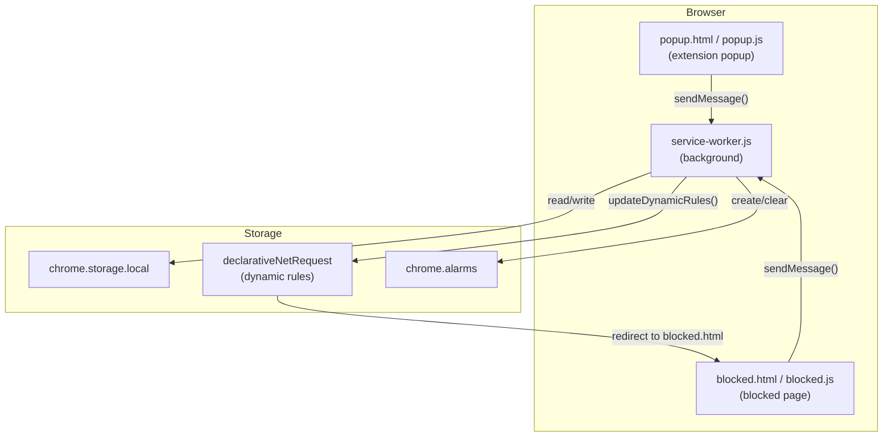

# Architecture

## What It Does

Focus Guard is a Chrome/Chromium extension (Manifest V3) that blocks distracting websites and requires physical hardware security key (WebAuthn/FIDO2) verification to temporarily unlock them. When a user navigates to a blocked domain, they are redirected to a built-in blocked page. Tapping their security key on that page triggers a full WebAuthn assertion flow; once verified, the service worker adds a high-priority allow rule for the domain and sets an alarm to automatically re-lock it after a configurable duration.

---

## Runtime Contexts

The extension runs across three independent JavaScript contexts. Each has different API access, and they communicate exclusively via `chrome.runtime.sendMessage`.



| Context | File(s) | Responsibilities |
|---|---|---|
| **Service Worker** | `service-worker.js` | Handles all messages; manages storage; creates/removes `declarativeNetRequest` rules; manages alarms; handles install/startup lifecycle |
| **Popup** | `popup.html`, `popup.js` | UI for managing the blocklist, registering/removing security keys, configuring unlock duration |
| **Blocked Page** | `blocked.html`, `blocked.js` | Shown when visiting a blocked site; handles the WebAuthn unlock flow |

---

## Module Overview

All shared logic lives in `lib/`:

| File | Purpose |
|---|---|
| `lib/storage.js` | Typed wrapper around `chrome.storage.local`; all persisted state goes through here |
| `lib/blocker.js` | Creates and removes `declarativeNetRequest` dynamic rules; manages block (IDs 1–9999) and allow (IDs 10001–19999) rule ID ranges |
| `lib/webauthn.js` | WebAuthn registration (`registerCredential`) and verification (`verifyWithCredential`); 4-layer hardware-only enforcement; sign counter clone detection; DER→IEEE P1363 signature conversion |
| `lib/normalize.js` | Strips protocol, `www.`, ports, paths, and query strings from user input; validates the result |
| `lib/cbor.js` | Minimal CBOR decoder for parsing WebAuthn attestation objects to extract AAGUID |

---

## Communication

All inter-context communication uses `chrome.runtime.sendMessage`. The service worker handles every message type in `handleMessage()` (`service-worker.js:82`).

| Message Type | Sender | Receiver | Payload | Response |
|---|---|---|---|---|
| `GET_STATE` | popup.js, blocked.js | service-worker.js | — | `{ blocklist, credential, unlocks, settings }` |
| `ADD_DOMAIN` | popup.js | service-worker.js | `{ domain }` | `{ blocklist }` |
| `REMOVE_DOMAIN` | popup.js | service-worker.js | `{ domain }` | `{ blocklist }` |
| `UNLOCK_DOMAIN` | blocked.js | service-worker.js | `{ domain }` | `{ success: true }` |
| `CLEAR_CREDENTIAL` | popup.js | service-worker.js | — | `{ success: true }` |
| `UPDATE_SETTINGS` | popup.js | service-worker.js | `{ unlockDurationMinutes }` | `{ settings }` |

---

## Storage Schema

All state is persisted in `chrome.storage.local` via `lib/storage.js`. Defaults are applied automatically when a key is missing.

```js
{
  // Array of normalized domain strings (e.g. "reddit.com")
  blocklist: ["reddit.com", "youtube.com", ...],

  // Null if no key registered; set by registerCredential()
  credential: {
    credentialId: "<base64url>",       // Identifies the key to the authenticator
    publicKeySpki: "<base64url>",      // SPKI DER public key for signature verification
    transports: ["usb"],               // Reported transports; used as allowCredentials hint
    signCount: 42,                     // Monotonic counter; incremented on each use
    aaguid: "f8a011f3-...",            // Authenticator AAGUID (UUID format)
    createdAt: "2026-01-01T00:00:00Z"  // ISO 8601 registration timestamp
  },

  // Active temporary unlocks, keyed by domain
  unlocks: {
    "reddit.com": {
      unlockedAt: 1700000000000,       // ms since epoch
      expiresAt:  1700001800000        // ms since epoch (unlockedAt + duration)
    }
  },

  // User-configurable settings
  settings: {
    unlockDurationMinutes: 30          // Default 30; options: 5, 15, 30, 60
  }
}
```

---

## Chrome APIs Used

| API | Where Used | Purpose |
|---|---|---|
| `chrome.storage.local` | `lib/storage.js` | Persisting blocklist, credential, unlocks, settings |
| `chrome.declarativeNetRequest` | `lib/blocker.js` | Creating/removing redirect (block) and allow rules |
| `chrome.alarms` | `service-worker.js` | Scheduling automatic domain re-lock after unlock duration |
| `chrome.runtime.sendMessage` | `popup.js`, `blocked.js` | Sending commands to the service worker |
| `chrome.runtime.onMessage` | `service-worker.js` | Receiving and routing messages |
| `chrome.runtime.onInstalled` | `service-worker.js` | Seeding default blocklist on first install |
| `chrome.runtime.onStartup` | `service-worker.js` | Cleaning up expired unlocks missed while browser was closed |
| `navigator.credentials` (WebAuthn) | `lib/webauthn.js` | Registering and asserting hardware security keys |
| `crypto.subtle` | `lib/webauthn.js` | Verifying ECDSA/RSA assertion signatures client-side |
