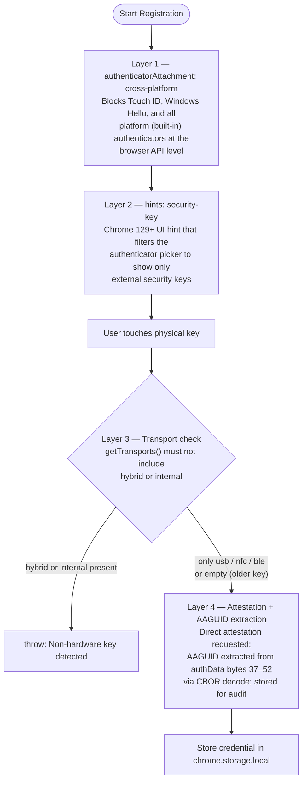
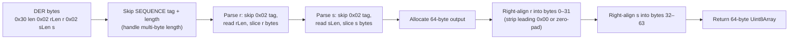
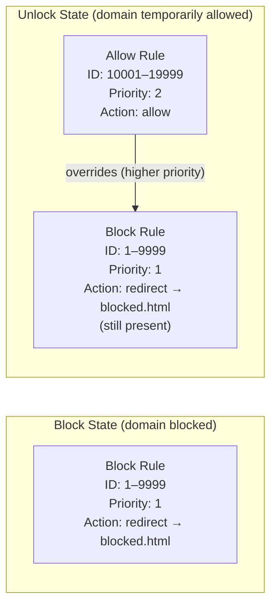

# Security Model

## Overview

Focus Guard's security rests on two pillars:

1. **Physical presence** — only a hardware security key (USB/NFC/BLE) can unlock a blocked site, never a password, PIN, or platform biometric.
2. **Client-side cryptographic verification** — the extension verifies the WebAuthn assertion signature itself using `crypto.subtle`, without trusting any server.

No data leaves the browser. There are no external dependencies, no network requests, and no build-time supply chain.

---

## WebAuthn Hardware Enforcement (4 Layers)

`lib/webauthn.js:101` (`registerCredential`) enforces hardware-only authenticators through four independent layers. All four must pass for registration to succeed.



### Why Four Layers?

No single layer is sufficient on its own:

| Layer | What It Prevents | Bypass Risk Without It |
|---|---|---|
| `cross-platform` attachment | Platform authenticators (Touch ID, Windows Hello) | A user could register their laptop's biometric |
| `security-key` hint | Passkey/phone options appearing in Chrome's picker | Confusing UX; user might select a software authenticator |
| Transport filter | Keys that report `internal` or `hybrid` transports | A Bluetooth phone-backed passkey could slip through |
| AAGUID + attestation | Completely uncertified/unknown authenticators | Provides a permanent audit record; enables future allowlist enforcement |

---

## Sign Counter / Clone Detection

Each time a hardware key is used, its internal counter increments. The extension stores the last-seen counter value and checks it on every assertion.

**Enforcement in `lib/webauthn.js:220`:**

```
newSignCount = authenticatorData[bytes 33–36] (big-endian uint32)

if (newSignCount !== 0 && newSignCount <= storedSignCount) {
    throw new Error("Sign counter did not increase — possible cloned authenticator")
}
```

| Counter value | Meaning |
|---|---|
| `0` | Authenticator does not implement counters (some keys); check is skipped |
| `> storedSignCount` | Expected; update stored value |
| `<= storedSignCount` | Counter went backwards or stayed the same — key may be cloned; throw |

After a successful assertion, the new counter value is persisted via `storage.js:setCredential()` (`lib/webauthn.js:231`), ensuring the next assertion must beat it.

---

## DER to IEEE P1363 Signature Conversion

WebAuthn authenticators return ECDSA signatures in DER (ASN.1) encoding. The Web Crypto API (`crypto.subtle.verify` with ECDSA) expects signatures in IEEE P1363 format (raw `r || s`, fixed-width). Without conversion, every verification would fail.

### DER Format (ASN.1 SEQUENCE)

```
0x30 <total-len>
  0x02 <r-len> <r-bytes>   ← r component (INTEGER, may have leading 0x00)
  0x02 <s-len> <s-bytes>   ← s component (INTEGER, may have leading 0x00)
```

### IEEE P1363 Format

```
<r padded to 32 bytes> <s padded to 32 bytes>   ← 64 bytes total for P-256
```

### Conversion Logic (`lib/webauthn.js:33`, `derToIEEEP1363`)



DER integers may include a leading `0x00` byte when the high bit is set (to preserve the positive sign). Conversely, short integers may be fewer than 32 bytes. The conversion handles both cases by right-aligning each component.

---

## declarativeNetRequest Rule Layering

Chrome's `declarativeNetRequest` API matches rules by priority. Focus Guard uses this to implement a toggleable block:



- Block rules (priority 1) redirect `main_frame` requests matching `||domain/` to `blocked.html?domain=<domain>`.
- Allow rules (priority 2) use Chrome's `allow` action, which causes the request to proceed without applying further rules from this extension.
- When a domain is unlocked, both rules coexist. The allow rule wins because `2 > 1`.
- When the alarm fires, only the allow rule is removed. The block rule was never removed, so the domain is immediately blocked again on the next navigation.

`syncBlockRules()` (`lib/blocker.js:52`) rebuilds all block rules at once, skipping domains that are currently unlocked. This prevents a block rule from ever coexisting without a paired allow rule in the unlocked state.

### Rule ID Ranges

| Range | Type | Managed By |
|---|---|---|
| 1–9999 | Block (redirect) | `syncBlockRules()` |
| 10001–19999 | Allow (temporary unlock) | `unlockDomain()` / `relockDomain()` |

---

## Challenge-Response Replay Prevention

Every unlock attempt generates a fresh 32-byte cryptographically random challenge:

```js
// lib/webauthn.js:175
const challenge = crypto.getRandomValues(new Uint8Array(32));
```

The challenge is embedded in `clientDataJSON` by the browser and signed by the hardware key. `crypto.subtle.verify` checks that the signature covers this challenge. An attacker who intercepts a valid assertion cannot reuse it because:

1. The challenge is random and single-use — no two assertions share the same challenge.
2. The signed data is `authenticatorData + SHA-256(clientDataJSON)`, and `clientDataJSON` contains the challenge, the origin (`chrome-extension://...`), and the request type (`webauthn.get`).
3. Even if an attacker captures the raw assertion bytes, they cannot forge a new challenge without the private key inside the hardware key.

---

## No External Dependencies

Focus Guard has zero npm dependencies, no build system, and no network requests at runtime. Every file is plain JavaScript loaded directly by Chrome. This means:

- No supply chain attack surface from third-party packages.
- No CDN or external host that could serve modified scripts.
- The full codebase fits in a handful of files that can be audited in minutes.

The only external code boundary is the browser's own WebAuthn and Web Crypto implementations, which are part of Chrome's trusted computing base.
