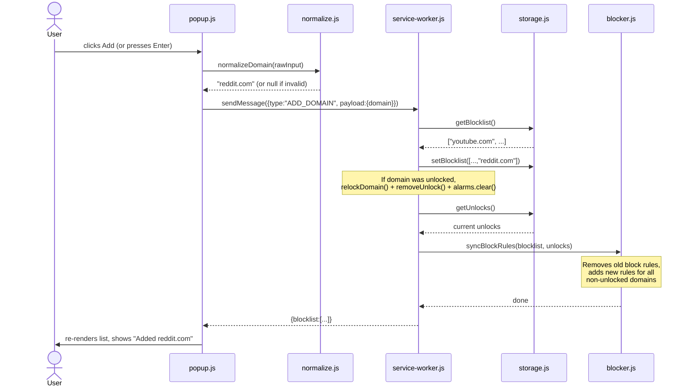
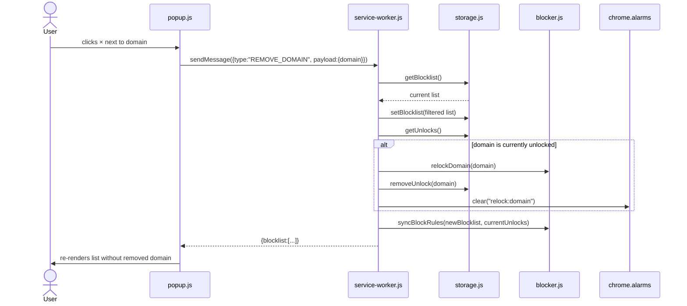
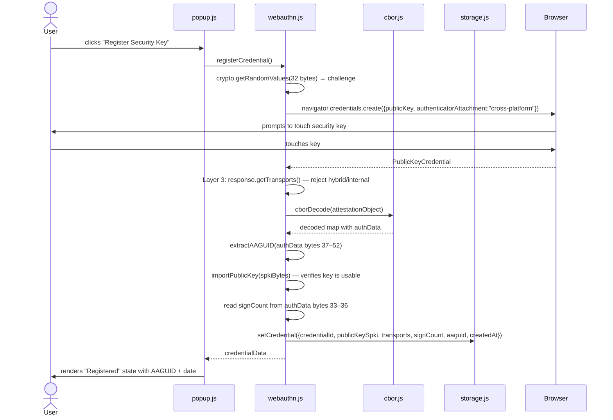
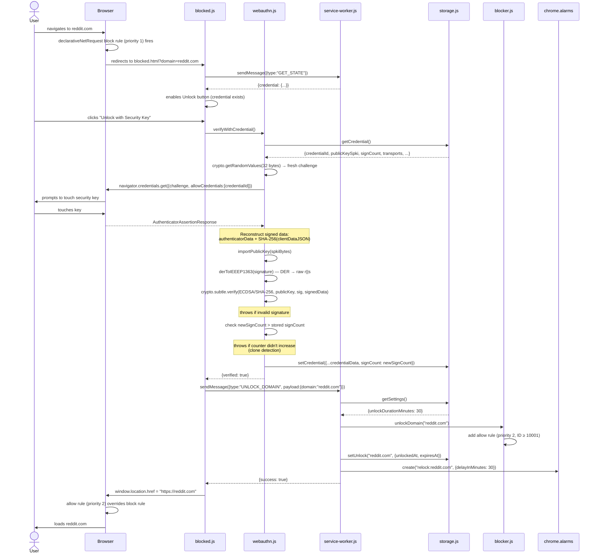
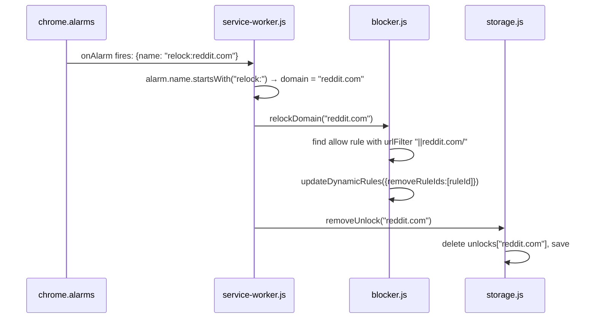
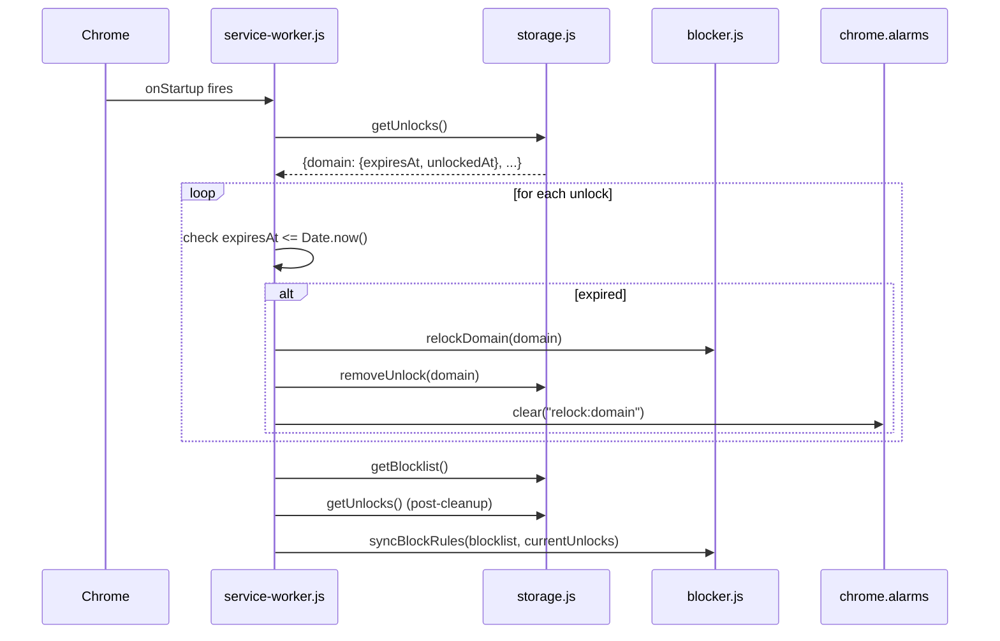
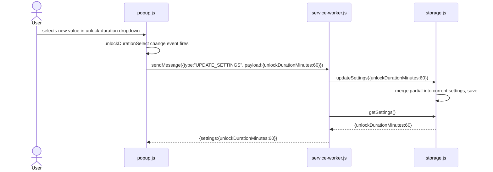

# User Flows

This document traces each main user action through the codebase, showing which files and functions are called in order. Sequence diagrams use actual file and function names.

## Overview

1. [Add Domain to Blocklist](#1-add-domain-to-blocklist)
2. [Remove Domain from Blocklist](#2-remove-domain-from-blocklist)
3. [Register a Security Key](#3-register-a-security-key)
4. [Unlock a Blocked Site](#4-unlock-a-blocked-site)
5. [Auto-Relock on Expiry](#5-auto-relock-on-expiry)
6. [Browser Startup Cleanup](#6-browser-startup-cleanup)
7. [Change Unlock Duration](#7-change-unlock-duration)

---

## 1. Add Domain to Blocklist

The user types a domain or URL into the popup input and clicks **Add**. `popup.js` normalizes the input, sends it to the service worker, which persists it and rebuilds the block rules.



**Key functions:**
- `popup.js:121` — `addDomain()`
- `lib/normalize.js:9` — `normalizeDomain()`
- `service-worker.js:91` — `ADD_DOMAIN` handler
- `lib/blocker.js:52` — `syncBlockRules()`

---

## 2. Remove Domain from Blocklist

The user clicks the × button next to a domain. The service worker removes it from the list, cleans up any active unlock for that domain, and rebuilds the block rules.



**Key functions:**
- `popup.js:140` — `removeDomain()`
- `service-worker.js:110` — `REMOVE_DOMAIN` handler
- `lib/blocker.js:88` — `relockDomain()`
- `lib/blocker.js:52` — `syncBlockRules()`

---

## 3. Register a Security Key

The user clicks **Register Security Key** in the popup. The browser's WebAuthn API prompts the user to touch their key. The extension enforces hardware-only usage via four layers before storing the credential.

### Hardware Enforcement Layers

```mermaid
flowchart TD
    A[navigator.credentials.create] --> B{Layer 1:<br/>authenticatorAttachment<br/>= cross-platform?}
    B -- "enforced in options" --> C{Layer 2:<br/>hints: security-key<br/>(Chrome 129+ UI)}
    C --> D[User touches key]
    D --> E{Layer 3:<br/>getTransports() check<br/>hybrid/internal rejected?}
    E -- "has hybrid or internal" --> F[throw Error: Non-hardware key detected]
    E -- "only usb/nfc/ble or empty" --> G{Layer 4:<br/>AAGUID extracted<br/>from attestation}
    G --> H[Store credential in storage.js]
    H --> I[Return credentialData to popup.js]
```

### Full Sequence



**Key functions:**
- `popup.js:148` — `handleRegister()`
- `lib/webauthn.js:101` — `registerCredential()`
- `lib/webauthn.js:64` — `extractAAGUID()`
- `lib/cbor.js:4` — `cborDecode()`
- `lib/storage.js:29` — `setCredential()`

---

## 4. Unlock a Blocked Site

This is the most complex flow. The user navigates to a blocked domain, is redirected to `blocked.html`, clicks **Unlock with Security Key**, and completes a WebAuthn assertion. The service worker then adds a temporary allow rule and schedules a re-lock alarm.



**Key functions:**
- `blocked.js:23` — click handler
- `lib/webauthn.js:169` — `verifyWithCredential()`
- `lib/webauthn.js:33` — `derToIEEEP1363()`
- `service-worker.js:127` — `UNLOCK_DOMAIN` handler
- `lib/blocker.js:72` — `unlockDomain()`
- `lib/storage.js:41` — `setUnlock()`

---

## 5. Auto-Relock on Expiry

When the unlock duration expires, Chrome fires the alarm created during the unlock flow. The service worker removes the allow rule and clears the unlock record.



Note: the block rule for `reddit.com` was never removed — only the allow rule (which was overriding it) is removed. The domain is immediately blocked again for the next navigation.

**Key functions:**
- `service-worker.js:62` — `onAlarm` listener
- `lib/blocker.js:88` — `relockDomain()`
- `lib/storage.js:47` — `removeUnlock()`

---

## 6. Browser Startup Cleanup

When Chrome starts, the service worker checks for unlocks that expired while the browser was closed (alarms do not fire for missed events). Expired unlocks are cleaned up, and block rules are re-synced to match current state.



**Key functions:**
- `service-worker.js:40` — `onStartup` listener
- `lib/blocker.js:52` — `syncBlockRules()`

---

## 7. Change Unlock Duration

The user selects a new duration from the dropdown in the popup. The change is sent directly to the service worker, which merges it into the settings object.



The new duration takes effect for the next unlock. Active unlocks are not modified.

**Key functions:**
- `popup.js:107` — `saveDuration()`
- `service-worker.js:158` — `UPDATE_SETTINGS` handler
- `lib/storage.js:57` — `updateSettings()`
